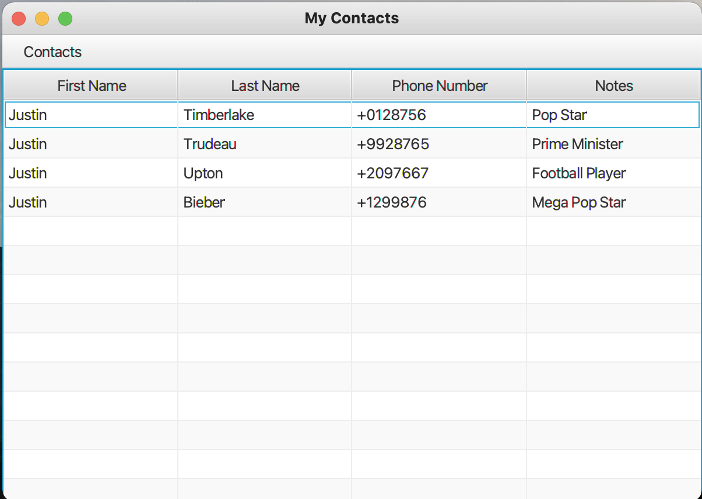
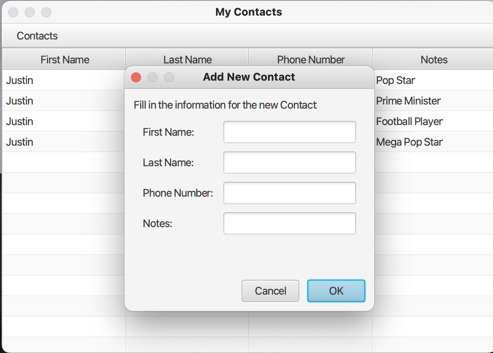
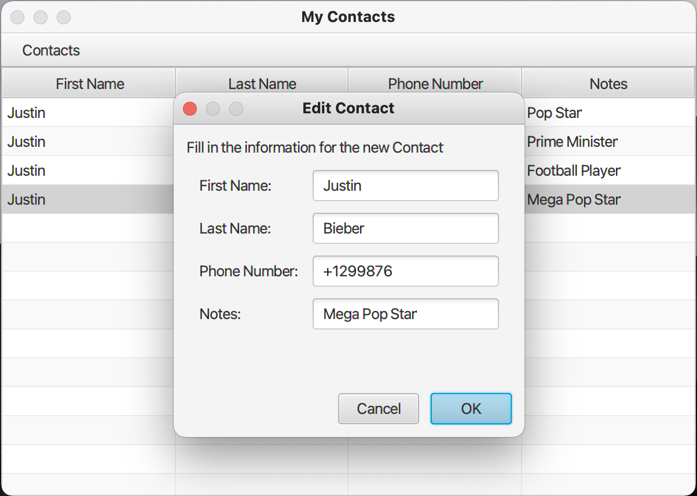
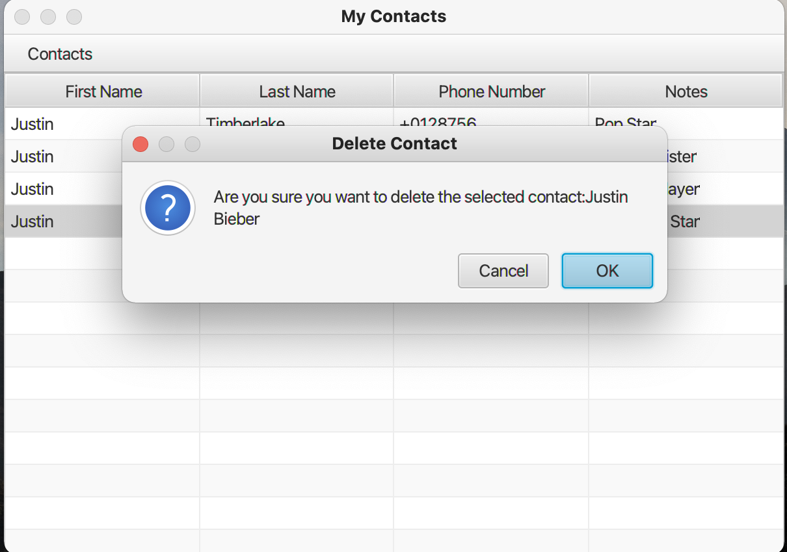

# Contacts List Application Project
## Project Brief:
Create simple contacts application that has a single main window. 
The application will allow the user to add a contact, edit a contact,
and delete a contact. 
## Installing:
1. Clone the repo

```
https://github.com/AAdewunmi/ContactsList.git
```

2. Open Project Folder


3. Explore

Enjoy :)
## UI Screenshots
1. Main Screen



2. Add Contact Screen



3. Edit Contact Screen



4. Delete Contact Screen


